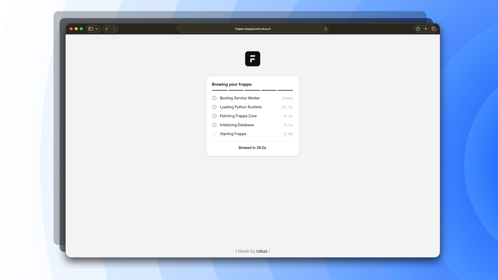

<p align="center"></p>



# Frappe Playground

Run the Frappe Framework in the browser with Pyodide and WebAssembly. The playground serves a Vue shell, boots Frappe inside a Web Worker, and routes same-origin Frappe requests through a Service Worker into Python WSGI. Runtime state is kept in the browser, so a tab can reload without needing a traditional Python server.

> [!CAUTION]
> Project is currently experimental and under active development.

## Overview

The playground has four main pieces:

1. **Vue shell (`src/`)**: Renders the loading screen, top bar, and Frappe Desk iframe. Vite builds it into `dist/frontend/`.
2. **Service Worker (`service-worker/src/`)**: Intercepts scoped browser requests, serves static files, mocks Socket.IO enough for Desk to settle, and forwards backend requests to the active Python worker.
3. **Pyodide server (`playground-server/src/`)**: Loads Pyodide, installs Python packages, mounts the Frappe runtime archive and starter SQLite database, applies browser-specific mocks, and handles WSGI requests.
4. **Runtime build (`Dockerfile.build`, `runtime/`, `scripts/build.sh`)**: Builds intermediate Frappe runtime artifacts into `artifacts/runtime/`. The application build assembles those artifacts and all authored browser sources into the clean `dist/` publish directory.

The app must be served from `localhost` or HTTPS with cross-origin isolation headers:

```text
Cross-Origin-Opener-Policy: same-origin
Cross-Origin-Embedder-Policy: require-corp
Cross-Origin-Resource-Policy: same-origin
Access-Control-Allow-Origin: *
```

Vite sets these headers during local development and preview. Cloudflare Pages uses the authored `public/_headers` file copied into `dist/` during assembly.

### Default Credentials

The playground preconfigures a streamlined authentication flow for instant experimentation:

The login form is automatically prefilled with username `Administrator` and password `admin` via the Vue shell (`src/App.vue`).

## Getting Started

Install dependencies:

```bash
npm install
```

Build the browser runtime with Docker:

```bash
npm run build:runtime
```

Start the local Vite dev server:

```bash
npm run dev
```

Open `http://localhost:5173/`.

For a production-style local preview, build the Vue shell and start Vite preview:

```bash
npm run build
npm start
```

Open `http://localhost:8000/`.

To run the complete deploy preparation flow in one command:

```bash
npm run deploy:prepare
```

This rebuilds the runtime artifacts, builds the frontend shell into a clean `dist/`, assembles the authored runtime files, and checks published asset limits.

## Directory Structure

```text
frappe-playground/
|-- src/                    # Vue shell source loaded by Vite
|-- service-worker/src/     # Authored Service Worker source
|-- playground-server/src/ # Authored Pyodide server source and configuration
|-- runtime/python/         # Authored browser-specific Python helpers and mocks
|-- public/                 # Authored static hosting files only
|-- artifacts/runtime/      # Generated intermediate runtime artifacts
|-- dist/                   # Generated deployable application
|-- scripts/
|   |-- build.sh            # Docker runtime build
|   |-- check-limits.sh     # Asset size limit verification
|   |-- deploy.sh           # Cloudflare Pages deployment
|   |-- export-runtime-assets.py # Frappe asset exporter for build
|   |-- prepare.sh          # Assembles runtime and authored files into dist/
|   `-- prepare-deploy.sh   # Full deploy preparation flow
|-- tests/
|   `-- e2e/                # Playwright browser flows
|-- Dockerfile.build
|-- vite.config.mjs
`-- playwright.config.js
```

`artifacts/` and `dist/` are generated and intentionally ignored by Git. Authored source files never live in either directory.

## Testing

The Playwright suite uses `http://localhost:8000` as its base URL. After assembling `dist/` with `npm run build` or `npm run deploy:prepare`, run the production preview before executing tests:

```bash
npm start
```

In another terminal:

```bash
npm run test
```

The e2e tests cover boot, login, setup wizard completion, Desk stability, scoped reload behavior, and the mobile shell.

## Deployment

Build the deployable `dist/` tree without publishing:

```bash
npm run deploy:prepare
```

Deploy to Cloudflare Pages:

```bash
npm run deploy
```

`npm run deploy` also runs `predeploy`, which prepares the runtime and frontend before publishing with `scripts/deploy.sh`.

## Meet Your Artisans

[LUBUS](https://lubus.in/?utm_source=github&utm_medium=open-source&utm_campaign=frappe-playground) is a web design agency based in Mumbai.

<a href="https://cal.com/lubus">

</a>

## License

Frappe Playground is open-sourced licensed under the [MIT License](LICENSE).
